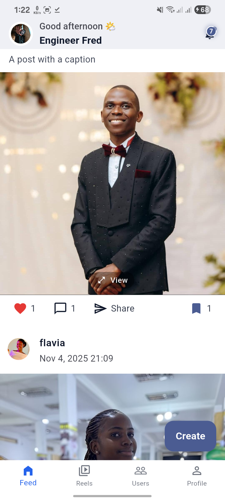
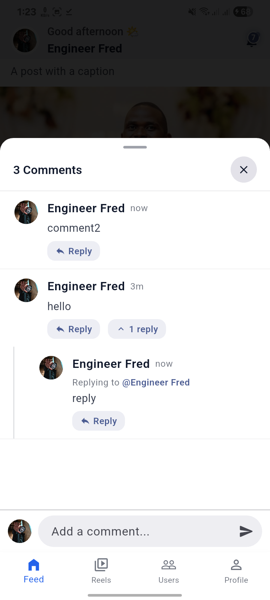
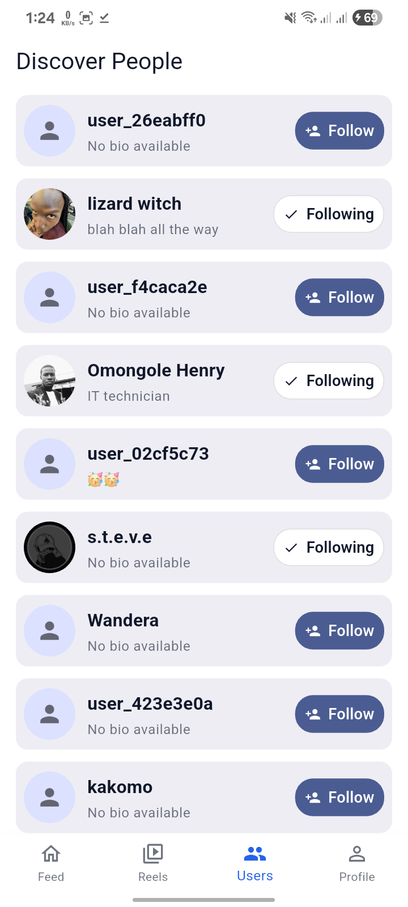
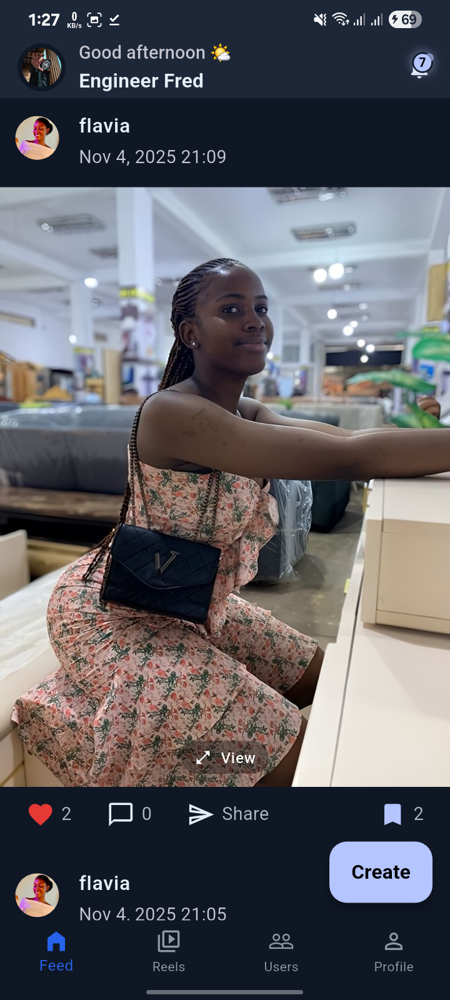
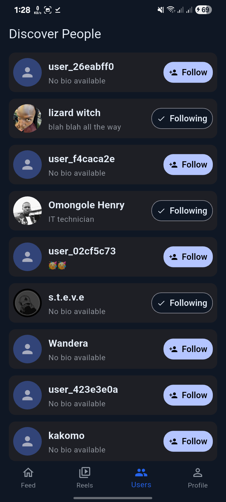
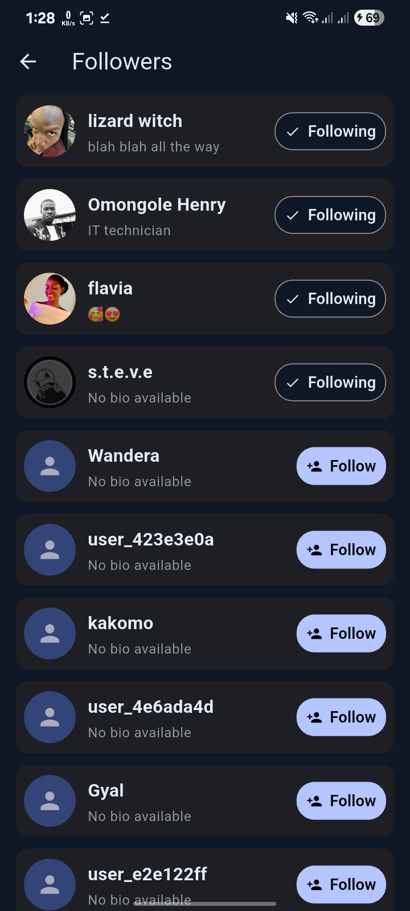

<div align="center">

# Vlone Blog
### A Modern Instagram Clone Built with Flutter

[](https://flutter.dev)
[](https://dart.dev)
[](https://blog.cleancoder.com/uncle-bob/2012/08/13/the-clean-architecture.html)
[](https://bloclibrary.dev)
[](https://supabase.com)
[]()

**Vlone Blog** is a high-performance social media platform inspired by Instagram’s user experience. Built strictly following **Clean Architecture principles**, it demonstrates how to build production-ready, modular Flutter applications.

[Report Bug](https://github.com/EngFred/vlone_blog/issues) · [Request Feature](https://github.com/EngFred/vlone_blog/issues)

</div>

---

## Overview

**Vlone Blog** delivers a fast, smooth, and visually stunning social experience. It features **posts, reels, likes, comments, and profile management**, all optimized for performance and scalability.

This project serves as a comprehensive example of:
* **Modular Architecture:** Separation of concerns using Feature-first Clean Architecture.
* **State Management:** Reactive UI updates using BLoC/Cubit.
* **Backend Integration:** Seamless connection with Supabase (BaaS) and Cloudinary.

---

## Download APK

Try the latest build of **Vlone Blog** on your Android device:

<div align="left">
  <a href="https://github.com/EngFred/Vlone-B_SOCIAL-MEDIA-APP-CLONE/releases/download/v1.0.0/vlone_blog_v1.0.0.apk">
    
  </a>
</div>

> **Note:** This build is for testing and demonstration purposes.

---

## App Screenshots

### Light Theme
<div style="display: flex; flex-wrap: wrap; gap: 10px; padding: 10px 0;">
  
  
  
  
</div>

### Dark Theme
<div style="display: flex; flex-wrap: wrap; gap: 10px; padding: 10px 0;">
  
  
  
  
</div>

---

## Features

### Authentication & Onboarding
- Secure Email/Password Login via **Supabase Auth**.
- Persistent user sessions with auto-login capabilities.
- Smooth, animated onboarding flow.

### Post Management
- Create, Edit, and Delete posts containing images or videos.
- Integrated Media Uploads via **Cloudinary**.
- Lazy pagination for infinite scrolling and optimized feed performance.

### Reels (Short Videos)
- TikTok/Reels style vertical scrolling.
- **Smart Caching & Preloading** for lag-free video playback.
- Interactive gestures: Double-tap to like, hold to pause.

### Engagement
- Real-time updates for Likes and Comments.
- Threaded comment sections.
- **Optimistic UI** updates for instant user feedback.

### Profile & Social Graph
- Edit profile details and avatars.
- Follow/Unfollow system with real-time counters.
- User activity feeds.

### Performance & Theming
- **Offline-first:** Robust caching strategy using Hive/SharedPreferences.
- **Dark/Light Mode:** System-aware theme switching.
- **Push Notifications:** Powered by Firebase Cloud Messaging.

---

## Tech Stack

| Domain | Technology |
| :--- | :--- |
| **Framework** |  |
| **Language** |  |
| **State Management** |  |
| **Backend (BaaS)** |  |
| **Media Storage** |  |
| **Local Storage** |  |
| **Dependency Injection** | GetIt |
| **Routing** | GoRouter |

---

## Architecture

The project implements **Clean Architecture** to ensure separation of concerns, testability, and scalability.

```text
lib/
├── core/                  # Shared logic (Network, Errors, Utils, Theme)
├── features/              # Feature-based modules
│   ├── auth/              # Login, Signup, Session
│   ├── feed/              # Posts, Infinite Scroll
│   ├── reels/             # Video Player, Cache Logic
│   ├── post_actions/      # Likes, Comments
│   ├── profile/           # User Details, Edit Profile
│   ├── notifications/     # Local & Push Notifications
│   └── settings/          # App Preferences
└── main.dart              # Entry Point
```

**Key Principles:**
* **Domain Layer:** Pure Dart code, defining business entities and use cases.
* **Data Layer:** Repositories, Data Sources (API/Local), and Models.
* **Presentation Layer:** BLoC/Cubits and UI Widgets.

---

## Setup Instructions

Follow these steps to run the project locally.

### 1. Clone the repository
```bash
git clone [https://github.com/EngFred/Vlone_Blog.git](https://github.com/EngFred/Vlone_Blog.git)
cd vlone_blog
```

---

### 2. Install dependencies
```bash
flutter pub get
```

### 3. Environment Configuration
Create a .env file at the root of your project:

SUPABASE_URL=your_supabase_url

SUPABASE_ANON_KEY=your_supabase_anon_key

---

### 4. Run the app
```bash
flutter run
```
