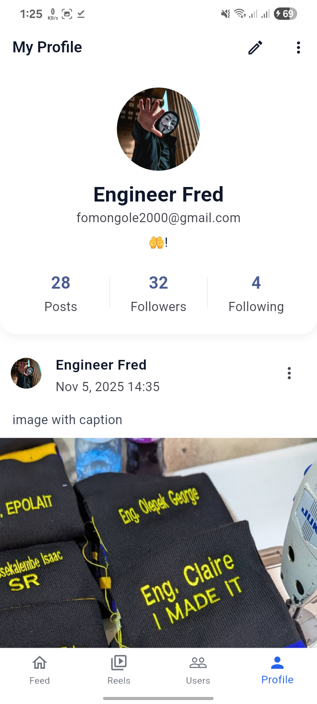
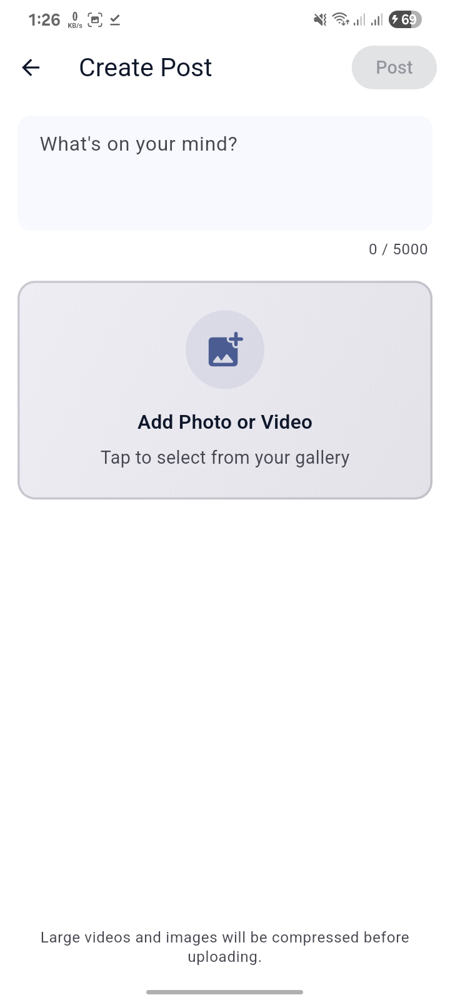
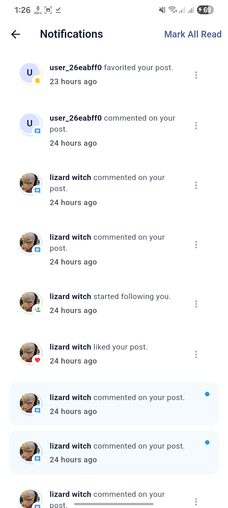
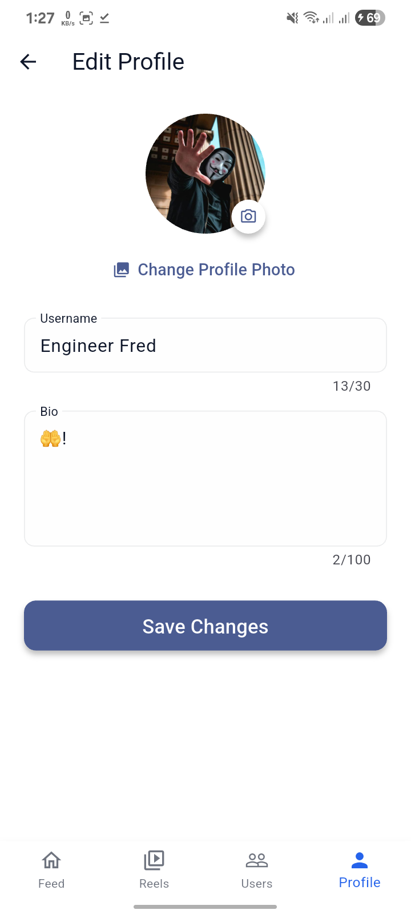
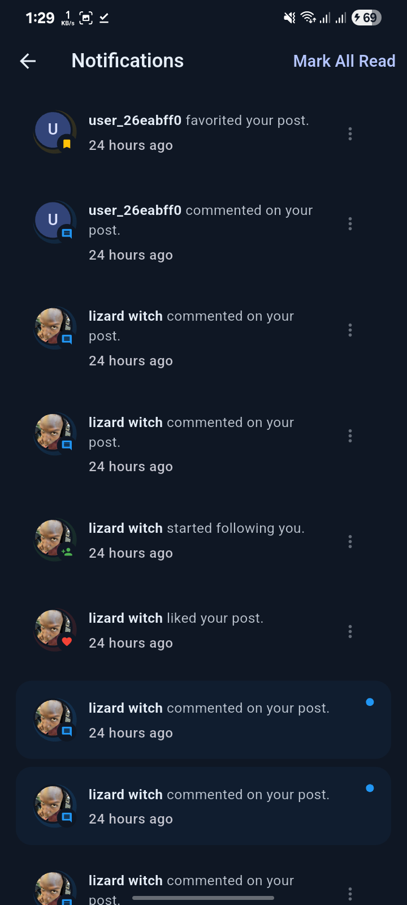
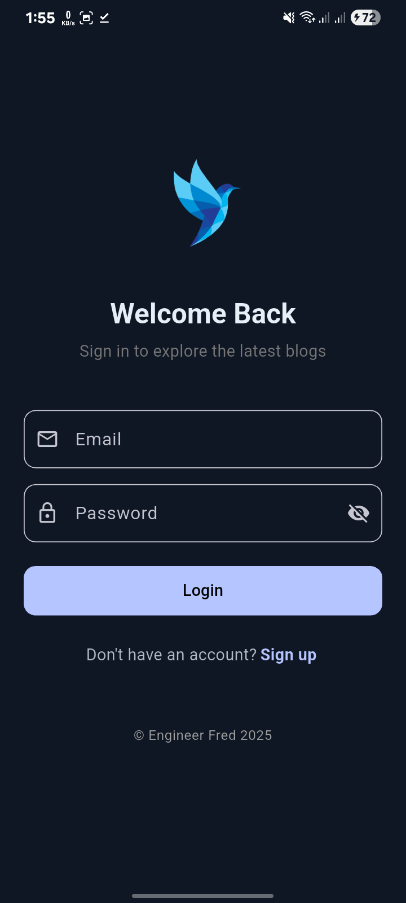
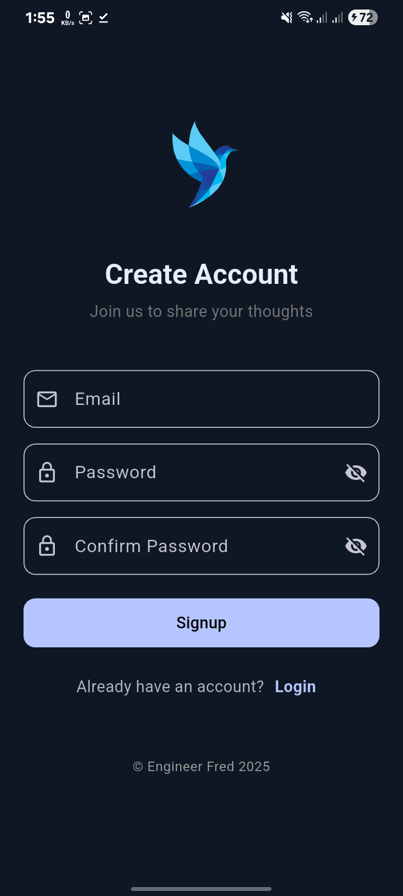

# Vlone Blog App — A Modern Instagram Clone Built with Flutter

## Overview
**Vlone Blog** is a modern **social media platform** inspired by Instagram’s clean design and user experience — built entirely with **Flutter** and following **Clean Architecture principles**.  
It delivers a fast, smooth, and visually stunning social experience featuring **posts, reels, likes, comments, profile management, and more**, optimized for performance and scalability.

This app is a demonstration of how to build **a production-ready, modular Flutter social app** using **Bloc**, and **Supabase** as Baas — all designed for a seamless cross-platform experience.

---

## Download APK

Get the latest release of **Vlone Blog** here( - JUST FOR TEST PURPOSES - ):

[Download v1.0.0 APK](https://github.com/EngFred/Vlone-B_SOCIAL-MEDIA-APP-CLONE/releases/download/v1.0.0/vlone_blog_v1.0.0.apk)

---

## App Screenshots (Light Theme)

<div style="display: flex; flex-wrap: wrap; gap: 10px; padding: 10px 0;">
  
  
  
  
  
  
  
  
</div>

---

## App Screenshots (Dark Theme)

<div style="display: flex; flex-wrap: wrap; gap: 10px; padding: 10px 0;">
  
  
  
  
  
  
  
  
</div>

---

## Features

**Authentication & Onboarding**  
- Email and password login/signup using **Supabase Auth**  
- Persistent sessions and auto-login  
- Smooth onboarding flow with animated transitions  

**Post Management**  
- Create, edit, and delete posts with images or videos  
- Media upload via **Cloudinary**  
- Optimized feed loading using lazy pagination  

**Reels (Short Videos)**  
- Smooth vertical scroll experience with **video preloading and caching**  
- Double-tap to like animations and gesture detection  
- Interactive action buttons (like, comment, share)  

**Likes, Comments & Engagement**  
- Real-time like count updates  
- Threaded comments  
- Optimistic UI for instant feedback  

**User Profiles & Following System**  
- View and edit profile info and profile picture  
- Follow/unfollow other users  
- Display follower/following counts  

**Notifications & Activity Feed**  
- Real-time updates for likes, comments, and follows  
- Push notifications powered by Firebase  

**Theme & Personalization**  
- Beautiful **light/dark mode** support  
- Modern, minimal UI inspired by Instagram’s aesthetic  

**Performance & Architecture**  
- Offline-first data caching strategy  
- Optimized rebuilds and image caching  
- Modular structure for scalability and testability  

---

## Architecture

This app follows **Flutter Clean Architecture** and **Bloc state management** for maintainability and scalability.

```
lib/
├── core/                # Common utilities, themes, routing, logging
├── features/
│   ├── auth/            # Authentication module
│   ├── feed/            # Posts and reels feed
│   ├── profile/         # User profiles and settings
│   ├── post_actions/    # Likes, comments, shares
│   ├── notifications/   # Push and in-app notifications
│   └── settings/        # Dark mode, account preferences
└── main.dart            # App entry point
```

**Principles followed:**
- Separation of concerns  
- Dependency injection  
- Reactive UI with `Bloc`  
- Reusable design system for consistent UI  
- Immutable state management  

---

## Tech Stack

| Layer | Technology |
|-------|-------------|
| **Framework** | Flutter (Dart) |
| **Architecture** | Clean Architecture, Bloc Pattern |
| **Backend** | Supabase (Auth, Database, Storage) |
| **Cloud Media** | Cloudinary |
| **Push Notifications** | Firebase Cloud Messaging |
| **Routing** | GoRouter |
| **Dependency Injection** | GetIt |
| **Storage & Cache** | Hive / SharedPreferences |
| **Animations** | flutter_animate, Lottie |
| **Testing** | flutter_test, bloc_test |
| **CI/CD** | GitHub Actions (optional setup) |

---

## Setup Instructions

### Clone the repository
```bash
git clone https://github.com/EngFred/vlone_blog.git
cd vlone_blog_app
```

### Install dependencies
```bash
flutter pub get
```

### Configure environment
Create a `.env` file at the root and add your credentials:
```env
SUPABASE_URL=https://your-supabase-url
SUPABASE_ANON_KEY=your-anon-key
```

### Run the app
```bash
flutter run
```

---

## Testing
Run the full test suite with:
```bash
flutter test
```
Or run widget tests only:
```bash
flutter test --tags=widget
```

---

## Design & UX Inspiration
The app draws inspiration from **Instagram’s modern visual language**, including:
- Minimalist layouts with accent colors  
- Smooth transitions and gesture-driven navigation  
- Polished micro-interactions (e.g. double-tap like animations)  
- Strong focus on user experience and perceived performance  

---

## Roadmap
- [ ] Implement Stories feature  
- [ ] Add Direct Messaging (chat)  
- [ ] Add Explore tab with content recommendations  
- [ ] Implement video creation within the app with filters 
- [ ] Integrate in-app analytics dashboard  

---

[engfred88@gmail.com]   
[LinkedIn](https://www.linkedin.com/in/fred-omongole-a5943b2b0/)
---

<div align="center">
  <strong>⭐ If you like this project, consider giving it a star!</strong><br>
  Made with ❤️ using Flutter.
</div>
